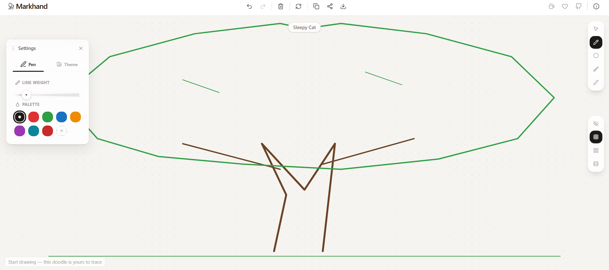
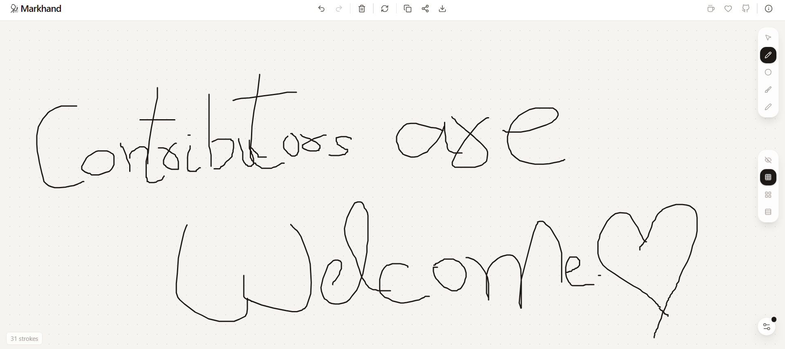

<p align="center">
  
</p>

<h1 align="center">Markhand</h1>

<p align="center">
  <strong>Your signature, perfected.</strong><br />
  Draw, practice, and export your mark - a beautiful digital signature tool.
</p>

<p align="center">
  <a href="./LICENSE">
    
  </a>
  
  
  
  
  
  
  
  
  <a href="https://github.com/byllzz">
    
  </a>
  
  
</p>

<p align="center">
  <a href="https://markhand.vercel.app">
    
  </a>
</p>

<p align="center">
  
  
</p>


<p align="center">
  <em>Draw your mark. Practice it. Own it. Export it anywhere.</em>
</p>

---

## What is Markhand?

**Markhand** is a free, open-source signature practice and creation tool. Draw your signature with customizable pens and guides, then export it as PNG or SVG - ready for documents, branding, emails, or wherever your mark needs to go.

Whether you're designing a new signature, practicing your handwriting, or need a quick digital signature for contracts, Markhand gives you a beautiful canvas to work on.

> **No sign-up. No ads. No servers. Just you and your mark.**

---

## Why Markhand?

Most people hate their signature. They scribble it on documents without thought, and digital signatures feel cold and impersonal.

**Markhand** changes that by giving you a space to practice, refine, and perfect your signature - or create something entirely new.

Whether you're:

- ✍️ Designing a signature for the first time
- 📄 Adding a personal touch to digital documents
- 🎨 Creating hand-drawn marks for branding
- 🖊️ Practicing calligraphy and lettering
- 🔗 Sharing your drawings with a simple link

Markhand adapts to **your hand**, not the other way around.

---

##  Features

### 🎨 Beautiful Canvas
Start with a random hand-drawn doodle - from hearts and stars to coffee cups and cats. Trace over it or clear it and start fresh. 10 unique doodles rotate on each visit.

### 🖊️ Customizable Pen
Choose from 8 colors and 6 stroke widths. The pen settings panel floats over the canvas, draggable and collapsible. Auto-switches to compatible ink when you change canvas themes.

### 🖱️ 5 Cursor Styles
Pick your pointer - Crosshair, Pencil, Dot, Brush, or Pen. Each one changes how your cursor looks while drawing.

### 📐 Guide Patterns
Toggle between Dot Grid, Line Grid, Ruled Lines, or No Guide. Perfect for practice, lettering, or technical drawing.

### 🎨 4 Canvas Themes
Switch between Default, Warm, Cool, and Dark backgrounds. Each theme has matching dot colors and auto-switches your pen ink for visibility.

### ↩️ Undo & Clear
Made a mistake? Undo it. Want a clean slate? Clear the canvas. Both have confirmation dialogs so you never lose work accidentally.

### 📤 Export & Share
- **PNG** - transparent or themed background
- **SVG** - clean vector output
- **Copy to clipboard** - paste directly into docs and emails
- **Print** - clean print-ready output
- **Share URL** - encode your drawing in a shareable link

### 💾 Persistent Storage
Everything saves to localStorage - your strokes, pen settings, theme, guide type, cursor, even the floating panel position. No account needed.

### 📱 Fully Responsive
Works on desktop, tablet, and mobile. UI adapts gracefully - non-essential buttons hide on small screens, touch-friendly targets throughout.

### 🔄 Reset & Fresh Start
One-click reset clears all data and reloads the app with a fresh doodle. Confirmation dialog prevents accidents.

---

##  How to Use

| Action | How to do it |
|--------|--------------|
| **Draw** | Click or touch the canvas and drag |
| **Change pen color** | Open settings panel (bottom-right) → Pen tab |
| **Change stroke width** | Use the slider in Pen tab |
| **Change cursor** | Click any icon in the top-left pills |
| **Change guides** | Click any icon in the right-center pills |
| **Change theme** | Open settings panel → Theme tab |
| **Undo** | Click ↩ in header or Ctrl+Z |
| **Clear canvas** | Click 🗑 in header |
| **Copy to clipboard** | Click 📋 in header |
| **Share drawing** | Click 🔗 in header |
| **Export** | Click ⬇ in header → choose format & background |
| **Print** | In export modal → click printer icon |
| **Reset all data** | Click 🔄 in header → confirm |
| **View instructions** | Click ℹ in header |

---

##  Project Structure
```
markhand/
├── public/
│ ├── favicon.svg
│ └── og.svg
├── src/
│ ├── components/
│ │ ├── canvas/
│ │ │ ├── CursorPills.tsx
│ │ │ ├── DrawingCanvas.tsx
│ │ │ └── GuidePills.tsx
│ │ ├── controls/
│ │ │ ├── PenControls.tsx
│ │ │ └── ThemeControls.tsx
│ │ ├── exports/
│ │ │ └── ExportModal.tsx
│ │ ├── layout/
│ │ │ ├── FloatingPanel.tsx
│ │ │ ├── Header.tsx
│ │ │ ├── InstructionsModal.tsx
│ │ │ └── ShareModal.tsx
│ │ └── ui/
│ │ ├── Button.tsx
│ │ ├── ColorPicker.tsx
│ │ ├── Slider.tsx
│ │ └── Toggle.tsx
│ ├── hooks/
│ │ └── useDraw.ts
│ ├── lib/
│ │ ├── canvas.ts
│ │ ├── cursors.ts
│ │ ├── doodles.ts
│ │ ├── export.ts
│ │ ├── ink.ts
│ │ ├── share.ts
│ │ └── storage.ts
│ ├── types/
│ │ └── index.ts
│ ├── App.tsx
│ ├── main.tsx
│ ├── index.css
│ └── vite-env.d.ts
├── index.html
├── package.json
├── tsconfig.json
├── tsconfig.app.json
├── tsconfig.node.json
├── vite.config.ts
├── tailwind.config.ts
├── postcss.config.js
└── README.md
```

---

##  Tech Stack

| Technology | Purpose |
|------------|---------|
| **React 19** | UI framework |
| **TypeScript** | Type safety |
| **Tailwind CSS v4** | Styling |
| **Vite 6** | Build tool |
| **Lucide React** | Icons |
| **React Icons** | Social icons |
| **Canvas API** | Drawing engine |

---

## Contributing
Contributions are welcome. Yes, even yours.

## How to contribute
* Fork the repository

* Create a feature branch
```bash
git checkout -b feature/amazing-feature
Commit your changes
```
* Commit your feature
```bash
git commit -m "Add amazing feature"
Push to your branch
```

* Push to your's branch
```bash
git push origin feature/amazing-feature
```
- *Open a Pull Request*

---

## Support
If OffTheGrid helps you, consider supporting the project:

-  Star this repository on GitHub
-  Share it with your friends
-  Leave feedback in GitHub Discussions
-  Buy me a coffee

<p align="left"> <a href="https://buymeacoffee.com/bilalmlkdev">  </a>

<a href="https://github.com/sponsors/byllzz">  </a> </p>

---

<p align="center"> Made with 💛 using React, TypeScript, and Tailwind CSS.<br /> <strong>Make your mark. ✍️</strong> </p><p align="center"> © 2026 Markhand - Open Source MIT </p>

