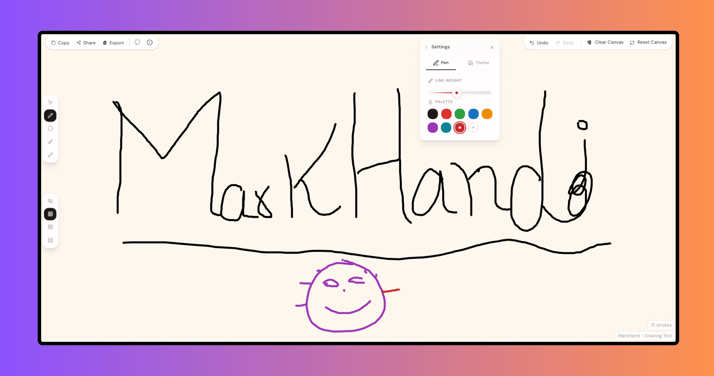

<p align="center">
  <a href="https://markhand.vercel.app/">
    
  </a>
</p>

<h1 align="center">Markhand</h1>

<p align="center">
  Draw, practice, and export your mark—a beautiful, free, open-source digital signature tool.
</p>

<p align="center">
  
  
  
  
  
  
</p>

<p align="center">
  <a href="https://markhand.vercel.app/">Live Demo</a> •
  <a href="https://github.com/byllzz/markhand/issues/new">Report Bug</a> •
  <a href="https://github.com/byllzz/markhand/issues/new">Request Feature</a>
</p>


# About Markhand

Markhand is an open-source digital signature studio designed for anyone who wants to draw, practice, and export their mark with precision and elegance. It combines a fluid drawing canvas, customizable tools, and a unique per-drawing URL system, all wrapped in a clean, responsive interface.

Unlike many online drawing tools that rely on servers or require accounts, Markhand runs entirely inside your browser. Every stroke is saved locally using `localStorage`, and every drawing gets its own dedicated URL. Clear the canvas, and you're instantly given a fresh, shareable link while previous drawings remain accessible through their original addresses.

Whether you're designing a personal signature, practicing calligraphy, adding a hand-drawn touch to digital documents, or simply exploring your creativity, Markhand provides a distraction-free workspace that adapts to your hand instead of forcing you to adapt to the tool.

# Features

- **Drawing** · Freehand drawing, multi-stroke support, responsive canvas, and 10+ doodle traces.
- **Customization** · 8 preset colors, custom color picker, 1px–12px stroke width, and four canvas themes.
- **Cursor & Guides** · Five cursor styles with Dot Grid, Line Grid, Ruled Lines, or no guide.
- **Editing** · Unlimited Undo, Redo, and smart canvas reset with a new drawing ID.
- **Export** · PNG (Theme, White, Transparent), SVG, clipboard copy, print-ready output, and shareable URLs.
- **Storage** · Per-drawing `localStorage`, persistent preferences, and completely offline operation.
- **Keyboard & Mobile** · Keyboard shortcuts, responsive layout, and collapsible mobile navigation.

# Architecture

Markhand is built around a clean separation between the drawing engine, state management, and the user interface.

Instead of tightly coupling canvas rendering with the UI, the application centralizes drawing logic inside a custom `useDraw` hook. This hook manages stroke history, undo/redo stacks, and canvas operations, while the React interface simply renders the current state and passes user interactions back to the engine. This separation keeps the codebase predictable, testable, and easy to extend.

Routing is handled by React Router, where each drawing is assigned a unique ID through the URL (`/dashboard/:id`). Whenever the canvas is cleared, a new ID is generated and the user is seamlessly redirected while preserving previous drawing data inside `localStorage`.

The entire application runs locally inside the browser without requiring any external APIs or server-side processing. Every stroke is rendered directly onto the HTML5 Canvas, ensuring fast, smooth, and privacy-friendly performance.


# Adding a New Doodle

Expanding Markhand's doodle collection requires only two small steps.

## Step 1

Create a new doodle inside:

```text
src/lib/doodles.ts
```

Each doodle should be an array of relative strokes with coordinates normalized between `0` and `1` so they scale perfectly to every canvas size.

```ts
export const doodles = [
  {
    name: "Example Doodle",
    strokes: [
      {
        id: "ex-1",
        color: "#1c1917",
        width: 4,
        points: [
          { x: 0.5, y: 0.2 },
          { x: 0.5, y: 0.8 }
        ]
      }
    ]
  }
];
```

## Step 2

Register the doodle inside the exported doodles array.

```ts
const doodles = [
  // existing doodles...

  {
    name: "Example Doodle",
    strokes: [...]
  }
];
```

Once registered, the new doodle automatically becomes part of the random doodle selection for fresh drawing sessions. No additional configuration is required.
# Project Structure

The project follows a clean React architecture where responsibilities are separated into reusable modules.

```text
markhand
├── public
├── src
│   ├── assets
│   ├── components
│   │   ├── canvas
│   │   ├── controls
│   │   ├── exports
│   │   ├── layout
│   │   └── ui
│   ├── hooks
│   ├── lib
│   ├── types
│   ├── App.tsx
│   ├── main.tsx
│   └── index.css
├── package.json
└── vite.config.ts
```

# Directory Overview

- **`components/canvas/`** · Drawing canvas, cursor pills, and guide pills.
- **`components/controls/`** · Pen and theme controls.
- **`components/exports/`** · Export and sharing modals.
- **`components/layout/`** · Header, floating settings panel, and instructions.
- **`components/ui/`** · Shared UI components like Button, Slider, Toggle, and ColorPicker.
- **`hooks/`** · Custom hooks for drawing, exporting, and undo/redo.
- **`lib/`** · Canvas utilities, doodles, storage, sharing, cursors, and helpers.
- **`types/`** · Shared TypeScript definitions.


# Design Principles

- **Pure Canvas Rendering** · Canvas functions remain side-effect free.
- **Client-Side Processing** · Everything runs entirely in the browser.
- **Per-Drawing Persistence** · Every drawing has isolated local storage.
- **Reusable Components** · Modular React components keep the UI consistent.
- **Extensible Architecture** · New doodles, guides, and cursors are easy to add.

Markhand is designed to remain responsive even while handling hundreds of strokes.

- **Native Canvas API** for hardware-accelerated rendering.
- **Memoized State** to reduce unnecessary re-renders.
- **Local Persistence** for instant loading and saving.
- **Client-Side Processing** with zero network requests during drawing and exporting.


# Built With

Markhand uses a modern frontend stack focused on performance, maintainability, and developer experience.

- React
- Vite
- Tailwind CSS v4
- TypeScript
- React Router DOM
- HTML5 Canvas API
- Lucide React

<p align="left">
  
</p>

# Getting Started

### Prerequisites

- Node.js
- npm or Yarn
- Modern web browser

### Quick Setup

```bash
git clone https://github.com/byllzz/markhand.git
cd markhand
npm install
npm run dev
```

### Build

```bash
npm run build
npm run preview
```

# Contributing

Contributions of every size are welcome.

Whether you're fixing a typo, improving accessibility, adding a new doodle, optimizing performance, or introducing an entirely new feature, every contribution helps make Markhand better.

Before opening a pull request, take a moment to understand how the drawing engine is organized. Most new features only require a small amount of code thanks to the project's modular architecture.


## Adding a New Doodle

Creating a new initial doodle is intentionally straightforward.

### 1. Create the Doodle

Add a new doodle set inside:

```text
src/lib/doodles.ts
```

Ensure coordinates are normalized between `0` and `1` so they scale correctly on every canvas.

### 2. Register the Doodle

Add your new doodle to the exported `doodles` array.

```ts
const doodles = [
  // existing doodles...

  {
    name: "My New Doodle",
    strokes: [...]
  }
];
```

Once registered, the new doodle automatically becomes part of the random selection pool for new drawing sessions.
# Author

<p align="left">
  
</p>

## Bilal Malik


If you enjoyed this project, consider giving it a ⭐ on GitHub. It helps others discover the project and motivates future improvements.

<p align="right">
  <a href="#markhand">⬆ Back to Top</a>
</p>


# License (MIT)

This project is licensed under the MIT License.

```text
MIT License

Copyright (c) 2026 Bilal Malik

Permission is hereby granted, free of charge, to any person obtaining a copy
of this software and associated documentation files (the "Software"), to deal
in the Software without restriction, including without limitation the rights
to use, copy, modify, merge, publish, distribute, sublicense, and/or sell
copies of the Software, and to permit persons to whom the Software is
furnished to do so, subject to the following conditions:

The above copyright notice and this permission notice shall be included in all
copies or substantial portions of the Software.

THE SOFTWARE IS PROVIDED "AS IS", WITHOUT WARRANTY OF ANY KIND, EXPRESS OR
IMPLIED, INCLUDING BUT NOT LIMITED TO THE WARRANTIES OF MERCHANTABILITY,
FITNESS FOR A PARTICULAR PURPOSE AND NONINFRINGEMENT. IN NO EVENT SHALL THE
AUTHORS OR COPYRIGHT HOLDERS BE LIABLE FOR ANY CLAIM, DAMAGES OR OTHER
LIABILITY, WHETHER IN AN ACTION OF CONTRACT, TORT OR OTHERWISE, ARISING FROM,
OUT OF OR IN CONNECTION WITH THE SOFTWARE OR THE USE OR OTHER DEALINGS IN THE
SOFTWARE.
```


<p align="left">
  © 2026 Markhand. Licensed under the MIT License.
</p>
